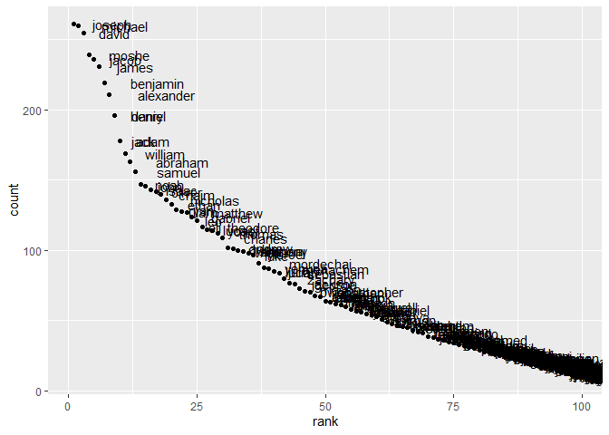

p8105\_hw2\_lg3158
================
Ling
10/4/2021

# Problem 1

Read the sheet:

``` r
Q1 = read_excel("./data/Trash-Wheel-Collection-Totals-7-2020-2.xlsx",
                sheet = "Mr. Trash Wheel",
                range = cell_cols("A:N"),
                trim_ws = T,
                skip = 1,
                col_names = T,
                col_types = c("numeric","guess","numeric","guess","numeric","numeric","numeric","numeric","numeric","numeric","numeric","numeric","numeric","numeric"),
                .name_repair = "universal") %>%
  janitor::clean_names() %>%
  mutate( sports_balls = round(sports_balls, digits = 0)) %>%
  drop_na(dumpster)
```

    ## Warning in read_fun(path = enc2native(normalizePath(path)), sheet_i = sheet, :
    ## Expecting numeric in A535 / R535C1: got 'Grand Total'

    ## New names:
    ## * `Weight (tons)` -> Weight..tons.
    ## * `Volume (cubic yards)` -> Volume..cubic.yards.
    ## * `Plastic Bottles` -> Plastic.Bottles
    ## * `Cigarette Butts` -> Cigarette.Butts
    ## * `Glass Bottles` -> Glass.Bottles
    ## * ...

The Q1 dataset now satisfies the criteria below:

-   read from the excel ‘Mr. Trash Wheel’ sheet;
-   omitted non-data entries;
-   cleaned variable names;
-   omitted rows with `NA` values in variable dumpster;
-   round the values of sports\_balls to the nearest integers

Now read and clean precipitation data for 2018 and 2019.

``` r
pre2018 <- read_excel("./data/Trash-Wheel-Collection-Totals-7-2020-2.xlsx",
                      range = "2018 Precipitation!A2:B14",
                      col_names = T,
                      col_types = c("guess","numeric"),
                      skip = 1,
                      .name_repair = "universal") %>%
  janitor::clean_names() %>%
  drop_na(total) %>%
  mutate(year = 2018) %>%
  relocate(year)

pre2019 <- read_excel("./data/Trash-Wheel-Collection-Totals-7-2020-2.xlsx",
                      range = "2019 Precipitation!A2:B14",
                      col_names = T,
                      col_types = c("guess","numeric"),
                      skip = 1) %>%
  janitor::clean_names() %>%
  drop_na(total) %>%
  mutate(year = 2019)

precipitation = bind_rows(pre2018, pre2019) %>%
  mutate(month = month.name[month]) %>%
  rename(precipitation_in = total)
  

Q1_final = left_join(Q1, precipitation, by = c("year","month"))
```

The dataset Q1\_final contains data from Mr. Trash Wheel sheet and the
precipitation data of 2018 and 2019. The brief summary of the data is
below:

|                                                  |           |
|:-------------------------------------------------|:----------|
| Name                                             | Q1\_final |
| Number of rows                                   | 453       |
| Number of columns                                | 15        |
| \_\_\_\_\_\_\_\_\_\_\_\_\_\_\_\_\_\_\_\_\_\_\_   |           |
| Column type frequency:                           |           |
| character                                        | 1         |
| numeric                                          | 13        |
| POSIXct                                          | 1         |
| \_\_\_\_\_\_\_\_\_\_\_\_\_\_\_\_\_\_\_\_\_\_\_\_ |           |
| Group variables                                  | None      |

Data summary

**Variable type: character**

| skim\_variable | n\_missing | complete\_rate | min | max | empty | n\_unique | whitespace |
|:---------------|-----------:|---------------:|----:|----:|------:|----------:|-----------:|
| month          |          0 |              1 |   3 |   9 |     0 |        13 |          0 |

**Variable type: numeric**

| skim\_variable       | n\_missing | complete\_rate |     mean |       sd |      p0 |     p25 |      p50 |      p75 |      p100 | hist  |
|:---------------------|-----------:|---------------:|---------:|---------:|--------:|--------:|---------:|---------:|----------:|:------|
| dumpster             |          0 |           1.00 |   227.00 |   130.91 |    1.00 |  114.00 |   227.00 |   340.00 |    453.00 | ▇▇▇▇▇ |
| year                 |          0 |           1.00 |  2017.26 |     1.95 | 2014.00 | 2015.00 |  2018.00 |  2019.00 |   2021.00 | ▆▃▇▃▃ |
| weight\_tons         |          0 |           1.00 |     3.20 |     0.73 |    0.78 |    2.72 |     3.19 |     3.68 |      5.62 | ▁▃▇▃▁ |
| volume\_cubic\_yards |          0 |           1.00 |    15.41 |     1.48 |    7.00 |   15.00 |    15.00 |    15.00 |     20.00 | ▁▁▁▇▂ |
| plastic\_bottles     |          0 |           1.00 |  1898.93 |  1027.78 |  210.00 |  980.00 |  1850.00 |  2640.00 |   5960.00 | ▇▇▅▁▁ |
| polystyrene          |          0 |           1.00 |  1920.92 |  1161.89 |  210.00 |  950.00 |  1650.00 |  2730.00 |   6540.00 | ▇▅▃▁▁ |
| cigarette\_butts     |          0 |           1.00 | 24521.68 | 32047.72 |  980.00 | 5000.00 | 11000.00 | 32000.00 | 310000.00 | ▇▁▁▁▁ |
| glass\_bottles       |          0 |           1.00 |    22.45 |    17.44 |    0.00 |    9.00 |    18.00 |    32.00 |    110.00 | ▇▃▂▁▁ |
| grocery\_bags        |          0 |           1.00 |  1103.82 |   860.26 |   50.00 |  425.00 |   820.00 |  1620.00 |   3750.00 | ▇▅▂▂▁ |
| chip\_bags           |          0 |           1.00 |  1558.40 |   946.59 |  180.00 |  800.00 |  1327.00 |  2150.00 |   5085.00 | ▇▆▃▁▁ |
| sports\_balls        |          0 |           1.00 |    11.75 |     9.18 |    0.00 |    5.00 |     9.00 |    16.00 |     56.00 | ▇▃▁▁▁ |
| homes\_powered       |          0 |           1.00 |    45.32 |    21.71 |    0.00 |   38.83 |    51.17 |    58.67 |     93.67 | ▃▂▇▅▁ |
| precipitation\_in    |        294 |           0.35 |     5.32 |     2.81 |    0.42 |    3.58 |     4.69 |     7.82 |     10.47 | ▃▅▇▁▅ |

**Variable type: POSIXct**

| skim\_variable | n\_missing | complete\_rate | min        | max        | median     | n\_unique |
|:---------------|-----------:|---------------:|:-----------|:-----------|:-----------|----------:|
| date           |          0 |              1 | 1900-01-20 | 2021-01-04 | 2018-02-05 |       275 |

For available data, the total precipitation in 2018 is 70.33 inches. The
median number of sports balls in a dumpster in 2019 was 9.

# Problem 2

Clean the data in pols-month.csv.

``` r
pols_month = read_csv("./data/fivethirtyeight_datasets/pols-month.csv") %>%
  separate(mon, into = c("year","month","day"), convert = T) %>%
  mutate(month = month.name[month]) %>%
  mutate(president = if_else(prez_gop == 1, "gop", "dem")) %>%
  select(-c("prez_gop","prez_dem","day"))
```

    ## Rows: 822 Columns: 9

    ## -- Column specification --------------------------------------------------------
    ## Delimiter: ","
    ## dbl  (8): prez_gop, gov_gop, sen_gop, rep_gop, prez_dem, gov_dem, sen_dem, r...
    ## date (1): mon

    ## 
    ## i Use `spec()` to retrieve the full column specification for this data.
    ## i Specify the column types or set `show_col_types = FALSE` to quiet this message.

Clean the data in snp.csv.

``` r
snp = read_csv("./data/fivethirtyeight_datasets/snp.csv") %>%
  mutate(date = lubridate::mdy(date)) %>%
  separate(date, into = c("year","month" ,NA), convert = T) %>%
  arrange(year, month) %>%
  mutate(month = month.name[month])
```

    ## Rows: 787 Columns: 2

    ## -- Column specification --------------------------------------------------------
    ## Delimiter: ","
    ## chr (1): date
    ## dbl (1): close

    ## 
    ## i Use `spec()` to retrieve the full column specification for this data.
    ## i Specify the column types or set `show_col_types = FALSE` to quiet this message.

Clean the data in unemployment.csv.

``` r
unem = read_csv("./data/fivethirtyeight_datasets/unemployment.csv") %>%
  rename(mon_1 = Jan,
         mon_2 = Feb,
         mon_3 = Mar,
         mon_4 = Apr,
         mon_5 = May,
         mon_6 = Jun,
         mon_7 = Jul,
         mon_8 = Aug,
         mon_9 = Sep,
         mon_10 = Oct,
         mon_11 = Nov,
         mon_12 = Dec,
         year = Year) %>%
  pivot_longer(
    cols = mon_1:mon_12,
    names_to = "month",
    values_to = "unemp_rate",
    names_prefix = "mon_"
  ) %>%
  mutate(month = month.name[as.numeric(month)])
```

    ## Rows: 68 Columns: 13

    ## -- Column specification --------------------------------------------------------
    ## Delimiter: ","
    ## dbl (13): Year, Jan, Feb, Mar, Apr, May, Jun, Jul, Aug, Sep, Oct, Nov, Dec

    ## 
    ## i Use `spec()` to retrieve the full column specification for this data.
    ## i Specify the column types or set `show_col_types = FALSE` to quiet this message.

Now merge the 3 datasets: snp into pols, then unemployment into the
merged.

``` r
merge_1 = left_join(pols_month,snp, by = c("year","month"))

merge_2 = left_join(merge_1, unem, by = c("year","month"))
```

The dataset `pols_month` includes the distribution of national
politicians in the 2 parties from 1947 to 2015. This dataset includes
these variables: year, month, gov\_gop, sen\_gop, rep\_gop, gov\_dem,
sen\_dem, rep\_dem, president. The dataset `snp` describes the S&P index
from 1969 to 2068, including these variables: year, month, close. The
dataset `unemployment` describes the percentage of the unemployment from
1948 to 2015. The brief descripition of the dataset and the distribution
of S&P index and percentage of unemployment is below:

|                                                  |          |
|:-------------------------------------------------|:---------|
| Name                                             | merge\_2 |
| Number of rows                                   | 822      |
| Number of columns                                | 11       |
| \_\_\_\_\_\_\_\_\_\_\_\_\_\_\_\_\_\_\_\_\_\_\_   |          |
| Column type frequency:                           |          |
| character                                        | 2        |
| numeric                                          | 9        |
| \_\_\_\_\_\_\_\_\_\_\_\_\_\_\_\_\_\_\_\_\_\_\_\_ |          |
| Group variables                                  | None     |

Data summary

**Variable type: character**

| skim\_variable | n\_missing | complete\_rate | min | max | empty | n\_unique | whitespace |
|:---------------|-----------:|---------------:|----:|----:|------:|----------:|-----------:|
| month          |          0 |              1 |   3 |   9 |     0 |        12 |          0 |
| president      |          0 |              1 |   3 |   3 |     0 |         2 |          0 |

**Variable type: numeric**

| skim\_variable | n\_missing | complete\_rate |    mean |     sd |      p0 |     p25 |     p50 |     p75 |    p100 | hist  |
|:---------------|-----------:|---------------:|--------:|-------:|--------:|--------:|--------:|--------:|--------:|:------|
| year           |          0 |           1.00 | 1980.75 |  19.79 | 1947.00 | 1964.00 | 1981.00 | 1998.00 | 2015.00 | ▇▇▇▇▇ |
| gov\_gop       |          0 |           1.00 |   22.48 |   5.68 |   12.00 |   18.00 |   22.00 |   28.00 |   34.00 | ▆▆▇▅▅ |
| sen\_gop       |          0 |           1.00 |   46.10 |   6.38 |   32.00 |   42.00 |   46.00 |   51.00 |   56.00 | ▃▃▇▇▇ |
| rep\_gop       |          0 |           1.00 |  194.92 |  29.24 |  141.00 |  176.00 |  195.00 |  222.00 |  253.00 | ▃▇▆▃▅ |
| gov\_dem       |          0 |           1.00 |   27.20 |   5.94 |   17.00 |   22.00 |   28.00 |   32.00 |   41.00 | ▆▅▇▆▂ |
| sen\_dem       |          0 |           1.00 |   54.41 |   7.37 |   44.00 |   48.00 |   53.00 |   58.00 |   71.00 | ▇▆▇▃▂ |
| rep\_dem       |          0 |           1.00 |  244.97 |  31.37 |  188.00 |  211.00 |  250.00 |  268.00 |  301.00 | ▇▂▇▇▅ |
| close          |        264 |           0.68 |  643.34 | 561.55 |   63.54 |  114.69 |  413.37 | 1146.78 | 2107.39 | ▇▁▃▂▁ |
| unemp\_rate    |         12 |           0.99 |    5.83 |   1.65 |    2.50 |    4.70 |    5.60 |    6.90 |   10.80 | ▃▇▅▂▁ |

# Problem 3

Loading and tidying the dataset.

``` r
Q3 = read_csv("./data/Popular_Baby_Names.csv") %>%
  janitor::clean_names() %>%
  mutate(gender = str_to_lower(gender),
         ethnicity = str_to_lower(ethnicity),
         gender = as_factor(gender),
         childs_first_name = as_factor(str_to_lower(childs_first_name)),
         ethnicity[ethnicity == "asian and paci"] <- "asian and pacific islander",
         ethnicity[ethnicity == "black non hisp"] <- "black non hispanic",
         ethnicity[ethnicity == "white non hisp"] <- "white non hispanic",
         ethnicity = as_factor(ethnicity)
         ) %>%
  select(year_of_birth, gender, ethnicity, childs_first_name, count, rank)
```

    ## Rows: 19418 Columns: 6

    ## -- Column specification --------------------------------------------------------
    ## Delimiter: ","
    ## chr (3): Gender, Ethnicity, Child's First Name
    ## dbl (3): Year of Birth, Count, Rank

    ## 
    ## i Use `spec()` to retrieve the full column specification for this data.
    ## i Specify the column types or set `show_col_types = FALSE` to quiet this message.

``` r
Q3 <- Q3[!duplicated(Q3), ]
```

Make a table showing the rank in popularity of the name “Olivia” as a
female baby name over time.

``` r
Q3_olivia <- subset(Q3, childs_first_name == "olivia" & gender == "female") %>%
  select(-childs_first_name) %>%
  arrange(year_of_birth)
knitr::kable(Q3_olivia)
```

| year\_of\_birth | gender | ethnicity                  | count | rank |
|----------------:|:-------|:---------------------------|------:|-----:|
|            2011 | female | asian and pacific islander |    89 |    4 |
|            2011 | female | black non hispanic         |    52 |   10 |
|            2011 | female | hispanic                   |    86 |   18 |
|            2011 | female | white non hispanic         |   213 |    2 |
|            2012 | female | asian and pacific islander |   132 |    3 |
|            2012 | female | black non hispanic         |    58 |    8 |
|            2012 | female | hispanic                   |    77 |   22 |
|            2012 | female | white non hispanic         |   198 |    4 |
|            2013 | female | asian and pacific islander |   109 |    3 |
|            2013 | female | black non hispanic         |    64 |    6 |
|            2013 | female | hispanic                   |    87 |   22 |
|            2013 | female | white non hispanic         |   233 |    1 |
|            2014 | female | asian and pacific islander |   141 |    1 |
|            2014 | female | black non hispanic         |    52 |    8 |
|            2014 | female | hispanic                   |    96 |   16 |
|            2014 | female | white non hispanic         |   248 |    1 |
|            2015 | female | asian and pacific islander |   188 |    1 |
|            2015 | female | black non hispanic         |    82 |    4 |
|            2015 | female | hispanic                   |    94 |   16 |
|            2015 | female | white non hispanic         |   225 |    1 |
|            2016 | female | asian and pacific islander |   172 |    1 |
|            2016 | female | black non hispanic         |    49 |    8 |
|            2016 | female | hispanic                   |   108 |   13 |
|            2016 | female | white non hispanic         |   230 |    1 |

Produce a similar table showing the most popular name among male
children over time. The table should be: - show the year of birth in an
ascending order (2011 -&gt; 2016). - by ethnicity group - the names
ranking “1”

``` r
Q3_pop_male = subset(Q3, gender == "male") %>%
  arrange(year_of_birth) %>%
  filter(rank == 1)
knitr::kable(Q3_pop_male)
```

| year\_of\_birth | gender | ethnicity                  | childs\_first\_name | count | rank |
|----------------:|:-------|:---------------------------|:--------------------|------:|-----:|
|            2011 | male   | asian and pacific islander | ethan               |   177 |    1 |
|            2011 | male   | black non hispanic         | jayden              |   184 |    1 |
|            2011 | male   | hispanic                   | jayden              |   426 |    1 |
|            2011 | male   | white non hispanic         | michael             |   292 |    1 |
|            2012 | male   | asian and pacific islander | ryan                |   197 |    1 |
|            2012 | male   | black non hispanic         | jayden              |   171 |    1 |
|            2012 | male   | hispanic                   | jayden              |   364 |    1 |
|            2012 | male   | white non hispanic         | joseph              |   300 |    1 |
|            2013 | male   | asian and pacific islander | jayden              |   220 |    1 |
|            2013 | male   | black non hispanic         | ethan               |   146 |    1 |
|            2013 | male   | hispanic                   | jayden              |   352 |    1 |
|            2013 | male   | white non hispanic         | david               |   304 |    1 |
|            2014 | male   | asian and pacific islander | jayden              |   187 |    1 |
|            2014 | male   | black non hispanic         | ethan               |   138 |    1 |
|            2014 | male   | hispanic                   | liam                |   312 |    1 |
|            2014 | male   | white non hispanic         | joseph              |   300 |    1 |
|            2015 | male   | asian and pacific islander | jayden              |   190 |    1 |
|            2015 | male   | black non hispanic         | noah                |   163 |    1 |
|            2015 | male   | hispanic                   | liam                |   356 |    1 |
|            2015 | male   | white non hispanic         | david               |   299 |    1 |
|            2016 | male   | asian and pacific islander | ethan               |   193 |    1 |
|            2016 | male   | black non hispanic         | noah                |   148 |    1 |
|            2016 | male   | hispanic                   | liam                |   387 |    1 |
|            2016 | male   | white non hispanic         | joseph              |   261 |    1 |

For male, white non-hispanic children born in 2016, produce a scatter
plot showing the number of children with a name (y axis) against the
rank in popularity of that name (x axis).

``` r
Q3_male_plot = subset(Q3, gender == "male" & ethnicity == "white non hispanic" & year_of_birth == 2016)
ggplot(Q3_male_plot, aes(x = rank, y = count, label = childs_first_name)) +
  geom_point() +
  geom_text(aes(label = childs_first_name), hjust = -0.5)
```

<!-- -->
